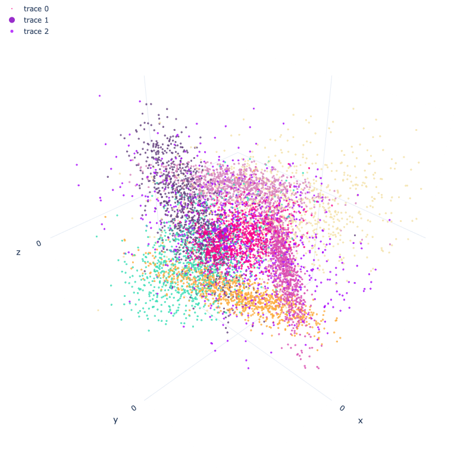
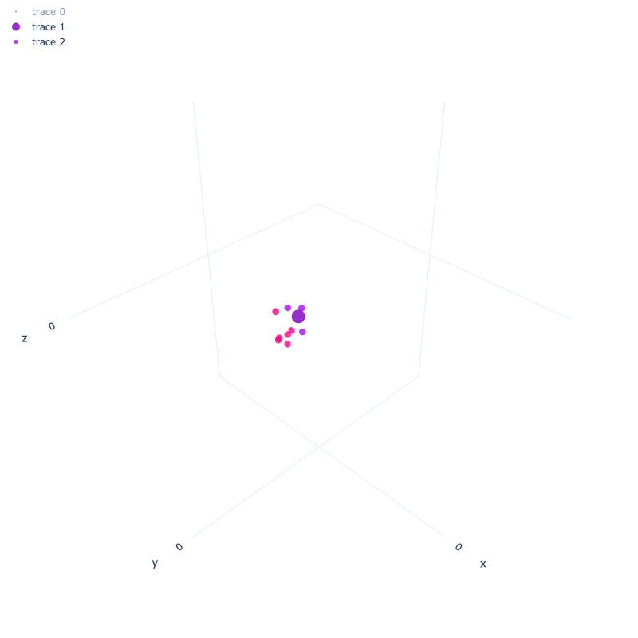

# kNN Simulation

A simulation of the kNN algorithm plotted using the `Plotly` library. Data is generated using `Scikit-learn` library, the data has 3 features.

Using `GridSearch` with different parameters of `kNN` algorithm built in `Scikit-learn` library to find the best parameters for the algorithm.

Then use `Plotly` to draw 3D simulations of the points in the data, with the number of neighbors found from GridSearch, draw those neighbors along with any chosen point to predict.

Origin data: 
Predicted point and *k* nearest points: 

The **predicted point** is mark the same color as the predicted class, and the *k* nearest points are mark the same color as the predicted class.
